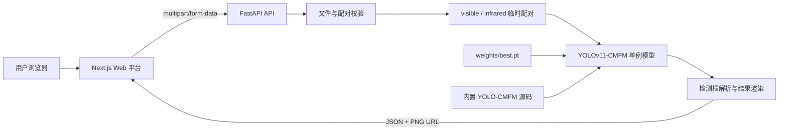

<div align="center">

# Intelligence Detect Platform

### 基于 YOLO-CMFM 的可见光–SAR 多模态遥感目标检测平台

[](https://github.com/bshr000/Intelligence-Detect-Platform/actions/workflows/ci.yml)
[](LICENSE)
[](https://fastapi.tiangolo.com/)
[](https://nextjs.org/)
[](https://www.python.org/)

面向可见光与 SAR 配准影像的端到端推理服务：上传双模态影像，运行四通道
YOLOv11-CMFM 推理，并在浏览器中查看检测框、类别置信度与运行耗时。

[快速开始](#快速开始) · [Windows CMD 测试](#windows-cmd-完整测试流程) · [Docker 部署](#docker-部署) · [API 使用](#api-使用) · [项目结构](#项目结构)

</div>

> [!IMPORTANT]
> 仓库暂不包含训练权重。使用真实推理前，请将检查点放到 `weights/best.pt`，或通过
> `MODEL_WEIGHTS` 指定路径。RGB 与 SAR 输入必须完成空间配准并具有相同宽高。

## 项目简介

Intelligence Detect Platform 将 YOLO-CMFM 模型封装为可部署的 Web 推理系统。后端使用
FastAPI 管理模型生命周期、双模态上传、推理并发和结果文件；前端使用 Next.js 提供图像上传、
检测控制、结果可视化和运行指标展示。

项目内置整理后的 YOLOv11-CMFM 源码。平台没有改写模型核心推理实现，而是在外层将上传图像
暂存为原数据加载器要求的 `visible/input.png` 和 `infrared/input.png`，继续调用：

```python
model.predict(
    source=visible_path,
    use_simotm="RGBT",
    channels=4,
    imgsz=640,
)
```

## 主要功能

- RGB 与 SAR 成对上传，支持 PNG、JPEG 和 TIFF
- 文件大小、图像解码和空间尺寸校验
- 复用原 YOLO-CMFM 四通道 `RGBT` 推理流程
- 模型启动时单例加载，避免每个请求重复加载权重
- GPU 推理并发限制与模型就绪检查
- 结构化检测结果：类别、置信度、归一化框和像素框
- 自动生成带检测框的 PNG 结果图
- Web 端输入预览、检测列表、耗时与状态展示
- OpenAPI/Swagger 文档、Docker Compose 和 GitHub Actions CI
- 无权重时保持 API 存活，并明确报告模型未就绪

## 系统架构



推理完成后，请求级临时输入会立即清理；结果 PNG 按 `RESULT_TTL_SECONDS` 配置保留。

## 环境要求

| 组件 | 建议版本/说明 |
| --- | --- |
| 操作系统 | Windows 10/11 或 Linux |
| Python | 3.11 推荐 |
| Node.js | 24 |
| pnpm | 11.21.0 |
| GPU | NVIDIA CUDA GPU，真实推理推荐 |
| CUDA / PyTorch | 建议与权重训练环境一致；Docker 默认 PyTorch 2.4.1 + CUDA 11.8 |
| Docker | 可选；GPU 容器需要 NVIDIA Container Toolkit |

CPU 环境可以启动服务，但大模型推理性能可能较低。CI 不安装模型依赖，也不执行 GPU 推理。

## 快速开始

### 1. 克隆仓库

```cmd
git clone https://github.com/bshr000/Intelligence-Detect-Platform.git
cd /d Intelligence-Detect-Platform
```

### 2. 准备模型权重

默认路径：

```text
weights/best.pt
```

权重文件不会进入 Git。也可以使用环境变量指定绝对路径：

```cmd
set "MODEL_WEIGHTS=D:\models\best.pt"
```

```bash
# Linux/macOS
export MODEL_WEIGHTS=/opt/models/best.pt
```

### 3. 启动后端

<details open>
<summary><strong>Windows CMD（推荐使用 Conda）</strong></summary>

```cmd
conda activate yolo-cmfm
python -m pip install --upgrade pip
python -m pip install -e .\third_party\YOLOv11-CMFM
python -m pip install -r .\backend\requirements-dev.txt
set "MODEL_WEIGHTS=weights\best.pt"
python -m uvicorn app.main:app --app-dir backend --host 127.0.0.1 --port 8000
```

</details>

<details>
<summary><strong>Linux</strong></summary>

```bash
python3 -m venv .venv
source .venv/bin/activate
python -m pip install --upgrade pip
python -m pip install -e ./third_party/YOLOv11-CMFM
python -m pip install -r ./backend/requirements-dev.txt
python -m uvicorn app.main:app --app-dir backend --reload --port 8000
```

</details>

### 4. 启动前端

另开终端；Windows 用户请在 CMD 中执行：

```cmd
cd /d D:\Codex\AI_Workspace\03_AI_Engineering\YOLO-CMFM-Platform\frontend
pnpm install --frozen-lockfile
copy /Y .env.example .env.local
pnpm dev
```

### 5. 访问服务

| 服务 | 地址 |
| --- | --- |
| Web 平台 | <http://localhost:3000> |
| Swagger API 文档 | <http://localhost:8000/docs> |
| API 存活检查 | <http://localhost:8000/api/v1/health/live> |
| 模型就绪检查 | <http://localhost:8000/api/v1/health/ready> |

未配置权重时，存活检查仍返回成功，但就绪检查返回 HTTP `503`。如只需开发前端，可在
`frontend/.env.local` 中设置 `NEXT_PUBLIC_USE_MOCK_API=true`。

## Windows CMD 完整测试流程

下面记录项目实际联调流程。所有命令均在 **Windows CMD** 中执行，不要直接复制到
PowerShell。完整测试需要三个 CMD 窗口：后端、API 测试和前端。

### 1. 准备 RGB/SAR 测试数据

准备一对完成空间配准且宽高相同的影像，例如：

```text
D:\test-data\visible.png
D:\test-data\sar.png
```

首次联调建议使用 8-bit PNG。当前加载器会将 RGB 读取为三通道，将 SAR 读取为单通道，
再组成四通道输入。两幅图仅文件尺寸相同还不够，内容也必须像素级对齐。

### 2. CMD 窗口一：启动 Conda 后端

进入项目：

```cmd
cd /d D:\Codex\AI_Workspace\03_AI_Engineering\YOLO-CMFM-Platform
```

推荐复用已经能够运行论文代码的 Conda 环境：

```cmd
conda env list
conda activate yolo-cmfm
```

如果需要新建环境，可执行：

```cmd
conda create -n yolo-cmfm python=3.11 -y
conda activate yolo-cmfm
```

先安装与本机 CUDA 匹配的 PyTorch，再安装模型和平台依赖。下面的 CUDA 11.8 版本与项目
Docker 配置一致；已有可用 PyTorch 环境时不要重复安装：

```cmd
python -m pip install --upgrade pip
python -m pip install torch==2.4.1 torchvision==0.19.1 --index-url https://download.pytorch.org/whl/cu118
python -m pip install timm
python -m pip install -e .\third_party\YOLOv11-CMFM
python -m pip install -r .\backend\requirements-dev.txt
```

检查 Python、PyTorch、CUDA 和 GPU：

```cmd
python --version
python -c "import torch; print('torch:', torch.__version__); print('cuda:', torch.cuda.is_available()); print('gpu:', torch.cuda.get_device_name(0) if torch.cuda.is_available() else 'CPU')"
```

项目默认查找 `weights\best.pt`。如果权重文件名不同，例如仓库当前使用
`weights\yolo11s-best.pt`，必须显式指定：

```cmd
set "MODEL_WEIGHTS=weights\yolo11s-best.pt"
set "MODEL_SOURCE_DIR=third_party\YOLOv11-CMFM"
set "MODEL_DEVICE=0"
set "MODEL_IMGSZ=640"
set "GPU_CONCURRENCY=1"
```

确认权重存在：

```cmd
if exist "%MODEL_WEIGHTS%" (echo Weight found) else (echo Weight not found)
```

启动 FastAPI；真实模型联调时建议先不使用 `--reload`，避免开发重载干扰 GPU 模型生命周期：

```cmd
python -m uvicorn app.main:app --app-dir backend --host 127.0.0.1 --port 8000
```

保持该窗口运行。模型加载成功后，后端开始监听 <http://127.0.0.1:8000>。

### 3. CMD 窗口二：健康检查

打开第二个 CMD，执行：

```cmd
curl.exe -s http://127.0.0.1:8000/api/v1/health/live
curl.exe -s http://127.0.0.1:8000/api/v1/health/ready
curl.exe -s http://127.0.0.1:8000/api/v1/models/current
```

通过标准：

- `health/live` 返回 HTTP 200；
- `health/ready` 中 `model_ready` 为 `true`；
- `models/current` 中的 `weights`、`source` 和 `device` 与当前配置一致。

如果 `ready` 返回 503，请先查看响应中的 `detail`，并检查权重路径、自定义
Ultralytics 源码、PyTorch/CUDA 版本和 GPU 状态。

### 4. Swagger API 推理测试

在第二个 CMD 中打开 Swagger：

```cmd
start "" "http://127.0.0.1:8000/docs"
```

在浏览器中：

1. 展开 `POST /api/v1/detections`；
2. 点击 `Try it out`；
3. `rgb_image` 选择可见光影像；
4. `sar_image` 选择配准后的 SAR 影像；
5. 设置 `confidence=0.25`、`iou=0.70`、`imgsz=640`；
6. 点击 `Execute`。

通过标准：HTTP 状态码为 200，响应中包含 `request_id`、耗时、`detections`、
`rgb_result_image_url` 和 `sar_result_image_url`。检测目标为空不代表接口失败，可先降低
`confidence` 或换用验证集样例确认模型效果。

### 5. curl API 推理测试

仍在第二个 CMD 中设置测试文件路径：

```cmd
set "RGB_IMAGE=D:\test-data\visible.png"
set "SAR_IMAGE=D:\test-data\sar.png"
```

确认文件存在：

```cmd
if exist "%RGB_IMAGE%" (echo RGB found) else (echo RGB missing)
if exist "%SAR_IMAGE%" (echo SAR found) else (echo SAR missing)
```

使用 `multipart/form-data` 提交真实推理请求，并把 JSON 保存到当前目录：

```cmd
curl.exe -sS -X POST "http://127.0.0.1:8000/api/v1/detections" -F "rgb_image=@%RGB_IMAGE%" -F "sar_image=@%SAR_IMAGE%" -F "confidence=0.25" -F "iou=0.70" -F "imgsz=640" -o detection-response.json
```

格式化查看响应：

```cmd
python -m json.tool detection-response.json
```

下载并打开 RGB/SAR 两张检测结果图：

```cmd
python -c "import json,urllib.request; d=json.load(open('detection-response.json',encoding='utf-8')); base='http://127.0.0.1:8000'; urllib.request.urlretrieve(base+d['rgb_result_image_url'],'rgb-detection-result.png'); urllib.request.urlretrieve(base+d['sar_result_image_url'],'sar-detection-result.png')"
start "" rgb-detection-result.png
start "" sar-detection-result.png
```

两张结果图应使用同一组检测框：RGB 结果以可见光为底图，SAR 结果以 SAR 为底图。
类别、置信度和框坐标应与 JSON 中的 `detections` 一致。

### 6. CMD 窗口三：启动和测试前端

打开第三个 CMD：

```cmd
cd /d D:\Codex\AI_Workspace\03_AI_Engineering\YOLO-CMFM-Platform\frontend
node --version
pnpm --version
```

项目建议 Node.js 24 和 pnpm 11.21.0。没有 pnpm 时可执行：

```cmd
corepack enable
corepack prepare pnpm@11.21.0 --activate
```

安装依赖、生成本地配置并进行 TypeScript 检查：

```cmd
pnpm install --frozen-lockfile
copy /Y .env.example .env.local
type .env.local
pnpm lint
```

本地配置应保持真实 API 模式，并默认通过 Next.js 同源代理访问后端：

```env
NEXT_PUBLIC_API_BASE_URL=
NEXT_PUBLIC_USE_MOCK_API=false
API_PROXY_TARGET=http://127.0.0.1:8000
```

启动前端：

```cmd
pnpm dev
```

另开 CMD 验证页面并打开浏览器：

```cmd
curl.exe -I http://127.0.0.1:3000
start "" "http://127.0.0.1:3000"
```

在页面中分别上传 RGB 和 SAR，点击 `Run Detection`。正常情况下，Output Viewer 会显示：

- `RGB Detection Result`：RGB 底图和检测框；
- `SAR Detection Result`：SAR 底图和同一组检测框；
- 检测目标数量、类别置信度和推理耗时。

按 `F12` 打开浏览器开发者工具，在 Network 中应看到：

```text
POST /api/v1/detections                 200
GET  /api/v1/results/{id}/rgb.png       200
GET  /api/v1/results/{id}/sar.png       200
```

前端默认使用同源 `/api` 代理，因此浏览器不需要直接跨域访问 8000 端口。修改
`.env.local` 或 `next.config.ts` 后必须停止并重新执行 `pnpm dev`。

### 7. 自动化测试与生产构建

后端无权重生命周期测试使用一个明确不存在的权重路径，避免误加载真实模型：

```cmd
cd /d D:\Codex\AI_Workspace\03_AI_Engineering\YOLO-CMFM-Platform
conda activate yolo-cmfm
set "MODEL_WEIGHTS=weights\__test_missing__.pt"
python -m pytest backend\tests
```

前端开发服务器停止后执行生产构建：

```cmd
cd /d D:\Codex\AI_Workspace\03_AI_Engineering\YOLO-CMFM-Platform\frontend
pnpm lint
pnpm build
pnpm start
```

### 8. 完整验收清单

- Conda 环境中的 PyTorch 能识别目标 GPU；
- 后端启动时成功加载 YOLO-CMFM 权重；
- `health/ready` 返回 `model_ready=true`；
- Swagger 推理返回 HTTP 200；
- curl 推理返回 HTTP 200，并能下载两张结果图；
- 前端请求、RGB 结果图和 SAR 结果图均返回 HTTP 200；
- 前端不是 Mock 模式；
- RGB/SAR 检测框、类别和置信度一致；
- `pytest`、`pnpm lint` 和 `pnpm build` 通过。

### 9. 常见联调问题

| 现象 | 检查与处理 |
| --- | --- |
| 后端记录 POST 200，但前端显示 `Failed to fetch` | 确认 `.env.local` 中 `NEXT_PUBLIC_API_BASE_URL=` 保持为空、`API_PROXY_TARGET=http://127.0.0.1:8000`，然后同时重启后端和 `pnpm dev`；浏览器 Network 中请求应为同源 `/api/v1/detections` |
| `/health/ready` 返回 503 | 查看 `detail`，检查 `MODEL_WEIGHTS`、`MODEL_SOURCE_DIR`、自定义 Ultralytics 依赖和 CUDA 环境 |
| 推理返回 422 | 检查文件扩展名、图像是否损坏，以及 RGB/SAR 宽高是否完全一致 |
| 推理返回 500 | 查看后端 CMD 的完整异常，重点检查显存、自定义 CMFM 模块和权重/源码版本是否匹配 |
| 端口 3000 或 8000 被占用 | 使用 `netstat -ano | findstr :3000` 或 `netstat -ano | findstr :8000` 查找占用进程，或为服务指定其他端口 |
| 修改环境变量后仍使用旧地址 | 停止对应服务并重新启动；`NEXT_PUBLIC_*` 变量会在 Next.js 启动或构建时读取 |

## Docker 部署

默认 Compose 配置使用 NVIDIA GPU：

```bash
docker compose up --build
```

启动后访问 <http://localhost:3000>。部署前请确认：

1. `weights/best.pt` 已存在；
2. 主机已安装 NVIDIA 驱动与 NVIDIA Container Toolkit；
3. Docker 能通过 `nvidia-smi` 访问 GPU；
4. PyTorch/CUDA 版本与检查点环境兼容。

停止服务：

```bash
docker compose down
```

## API 使用

### 推理接口

```text
POST /api/v1/detections
Content-Type: multipart/form-data
```

| 字段 | 类型 | 必填 | 默认值 | 说明 |
| --- | --- | :---: | ---: | --- |
| `rgb_image` | File | 是 | — | 可见光 RGB 影像 |
| `sar_image` | File | 是 | — | 与 RGB 空间配准的 SAR 影像 |
| `confidence` | float | 否 | `0.25` | 置信度阈值，范围 `[0, 1]` |
| `iou` | float | 否 | `0.70` | NMS IoU 阈值，范围 `[0, 1]` |
| `imgsz` | int | 否 | `640` | 推理输入尺寸，范围 `[32, 4096]` |

示例：

```bash
curl -X POST "http://localhost:8000/api/v1/detections" \
  -F "rgb_image=@/path/to/visible.png" \
  -F "sar_image=@/path/to/sar.png" \
  -F "confidence=0.25" \
  -F "iou=0.70" \
  -F "imgsz=640"
```

响应包含模型、设备、各阶段耗时、输入尺寸、检测列表和结果图 URL：

```json
{
  "request_id": "a-generated-uuid",
  "model": "YOLOv11-CMFM",
  "device": "0",
  "inference_time": 0.042,
  "image_width": 1024,
  "image_height": 1024,
  "result_image_url": "/api/v1/results/a-generated-uuid.png",
  "rgb_result_image_url": "/api/v1/results/a-generated-uuid/rgb.png",
  "sar_result_image_url": "/api/v1/results/a-generated-uuid/sar.png",
  "detections": [
    {
      "id": "det-0",
      "class_id": 0,
      "label": "bridge",
      "confidence": 0.93,
      "bbox": {"x": 0.12, "y": 0.18, "width": 0.31, "height": 0.20},
      "bbox_pixels": [123.0, 184.0, 440.0, 389.0]
    }
  ]
}
```

### 其他接口

| 方法 | 路径 | 说明 |
| --- | --- | --- |
| `GET` | `/api/v1/health/live` | API 进程存活状态 |
| `GET` | `/api/v1/health/ready` | 模型与权重就绪状态 |
| `GET` | `/api/v1/models/current` | 当前模型、设备、权重和源码信息 |
| `GET` | `/api/v1/results/{request_id}.png` | 获取 RGB 检测结果图（兼容接口） |
| `GET` | `/api/v1/results/{request_id}/rgb.png` | 获取 RGB 检测结果图 |
| `GET` | `/api/v1/results/{request_id}/sar.png` | 获取 SAR 检测结果图 |

## 配置

后端配置示例见 `backend/.env.example`：

| 环境变量 | 默认值 | 说明 |
| --- | --- | --- |
| `MODEL_WEIGHTS` | `weights/best.pt` | 模型权重路径 |
| `MODEL_SOURCE_DIR` | `third_party/YOLOv11-CMFM` | 模型源码目录 |
| `MODEL_DEVICE` | `0` | CUDA 设备编号或 `cpu` |
| `MODEL_IMGSZ` | `640` | 默认输入尺寸 |
| `GPU_CONCURRENCY` | `1` | 同一进程最大并发推理数 |
| `MAX_UPLOAD_MB` | `50` | 单个上传文件大小上限 |
| `RESULT_TTL_SECONDS` | `3600` | 结果 PNG 保留时间 |
| `CORS_ORIGINS` | `http://localhost:3000,...` | 允许访问 API 的前端来源 |

前端配置示例见 `frontend/.env.example`：

| 环境变量 | 默认值 | 说明 |
| --- | --- | --- |
| `NEXT_PUBLIC_API_BASE_URL` | 空 | 浏览器直连 FastAPI 地址；留空时使用同源 Next.js 代理 |
| `NEXT_PUBLIC_USE_MOCK_API` | `false` | 是否使用前端 Mock 结果 |
| `API_PROXY_TARGET` | `http://127.0.0.1:8000` | Next.js 服务端代理的 FastAPI 地址 |

## 项目结构

```text
Intelligence-Detect-Platform/
├── backend/
│   ├── app/
│   │   ├── config.py          # 环境配置
│   │   ├── main.py            # FastAPI 路由与生命周期
│   │   ├── model_service.py   # 双模态适配与模型调用
│   │   └── schemas.py         # API 数据模型
│   ├── tests/                 # 无权重 API 测试
│   └── Dockerfile
├── frontend/
│   ├── app/                   # Next.js App Router
│   ├── components/            # 上传、控制与结果组件
│   ├── lib/                   # API 客户端与类型
│   └── Dockerfile
├── third_party/
│   └── YOLOv11-CMFM/          # 原始模型源码与 CMFM 模块
├── weights/
│   └── README.md              # 权重放置说明；*.pt 不进入 Git
├── .github/workflows/ci.yml
├── docker-compose.yml
└── README.md
```

## 开发与测试

后端测试：

```bash
python -m pytest backend/tests
```

前端类型检查和生产构建：

```bash
cd frontend
pnpm lint
pnpm build
```

当前 CI 验证后端无权重生命周期、API 契约、前端类型检查和生产构建。真实模型推理应在具备
对应权重和 GPU 的环境中执行端到端测试。

## 项目状态

- [x] FastAPI 模型生命周期与健康检查
- [x] RGB/SAR 双模态上传和尺寸校验
- [x] YOLOv11-CMFM 原推理流程适配
- [x] 检测 JSON 与结果图输出
- [x] Next.js Web 可视化平台
- [x] Docker Compose 与基础 CI
- [ ] 发布可下载的模型权重及 SHA-256
- [ ] 增加真实样例图和端到端 GPU 测试
- [ ] 增加批量推理与任务历史
- [ ] 增强 GeoTIFF 元数据和超大遥感影像支持

## 使用注意事项

- RGB 与 SAR 必须来自同一区域并完成像素级空间配准。
- 两幅图像必须具有相同宽高；平台不会自动修正空间错位。
- 当前模型加载器将 SAR 作为单通道灰度输入，并与 RGB 合并为四通道张量。
- 上传内容仅用于本次推理；临时输入会在请求结束后删除。
- 生产部署应通过反向代理配置 HTTPS、请求体限制和访问控制。

## 致谢与引用

模型实现基于 [YOLO-CMFM](https://github.com/bshr000/YOLO-CMFM) 与 Ultralytics YOLO。
仓库内模型源码及引用信息见：

- `third_party/YOLOv11-CMFM/CITATION.cff`
- `third_party/YOLOv11-CMFM/LICENSE`
- `THIRD_PARTY_NOTICES.md`

若本项目或 YOLO-CMFM 对你的研究有帮助，请在正式论文信息发布后按项目提供的引用格式引用。

## 许可证

本仓库包含 AGPL-3.0 许可的 Ultralytics/YOLOv11-CMFM 衍生代码，整体按
[GNU Affero General Public License v3.0](LICENSE) 发布。第三方说明见
[THIRD_PARTY_NOTICES.md](THIRD_PARTY_NOTICES.md)。
