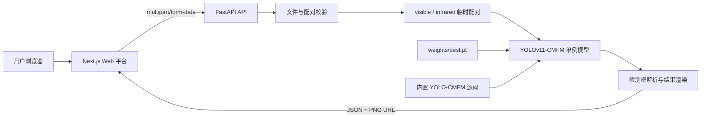

<div align="center">

# Intelligence Detect Platform

### 基于 YOLO-CMFM 的可见光–SAR 多模态遥感目标检测平台

[](https://github.com/bshr000/Intelligence-Detect-Platform/actions/workflows/ci.yml)
[](LICENSE)
[](https://fastapi.tiangolo.com/)
[](https://nextjs.org/)
[](https://www.python.org/)

面向可见光与 SAR 配准影像的端到端推理服务：上传双模态影像，运行四通道
YOLOv11-CMFM 推理，并在浏览器中查看检测框、类别置信度与运行耗时。

[快速开始](#快速开始) · [Docker 部署](#docker-部署) · [API 使用](#api-使用) · [项目结构](#项目结构)

</div>

> [!IMPORTANT]
> 仓库暂不包含训练权重。使用真实推理前，请将检查点放到 `weights/best.pt`，或通过
> `MODEL_WEIGHTS` 指定路径。RGB 与 SAR 输入必须完成空间配准并具有相同宽高。

## 项目简介

Intelligence Detect Platform 将 YOLO-CMFM 模型封装为可部署的 Web 推理系统。后端使用
FastAPI 管理模型生命周期、双模态上传、推理并发和结果文件；前端使用 Next.js 提供图像上传、
检测控制、结果可视化和运行指标展示。

项目内置整理后的 YOLOv11-CMFM 源码。平台没有改写模型核心推理实现，而是在外层将上传图像
暂存为原数据加载器要求的 `visible/input.png` 和 `infrared/input.png`，继续调用：

```python
model.predict(
    source=visible_path,
    use_simotm="RGBT",
    channels=4,
    imgsz=640,
)
```

## 主要功能

- RGB 与 SAR 成对上传，支持 PNG、JPEG 和 TIFF
- 文件大小、图像解码和空间尺寸校验
- 复用原 YOLO-CMFM 四通道 `RGBT` 推理流程
- 模型启动时单例加载，避免每个请求重复加载权重
- GPU 推理并发限制与模型就绪检查
- 结构化检测结果：类别、置信度、归一化框和像素框
- 自动生成带检测框的 PNG 结果图
- Web 端输入预览、检测列表、耗时与状态展示
- OpenAPI/Swagger 文档、Docker Compose 和 GitHub Actions CI
- 无权重时保持 API 存活，并明确报告模型未就绪

## 系统架构



推理完成后，请求级临时输入会立即清理；结果 PNG 按 `RESULT_TTL_SECONDS` 配置保留。

## 环境要求

| 组件 | 建议版本/说明 |
| --- | --- |
| 操作系统 | Windows 10/11 或 Linux |
| Python | 3.11 推荐 |
| Node.js | 24 |
| pnpm | 11.21.0 |
| GPU | NVIDIA CUDA GPU，真实推理推荐 |
| CUDA / PyTorch | 建议与权重训练环境一致；Docker 默认 PyTorch 2.4.1 + CUDA 11.8 |
| Docker | 可选；GPU 容器需要 NVIDIA Container Toolkit |

CPU 环境可以启动服务，但大模型推理性能可能较低。CI 不安装模型依赖，也不执行 GPU 推理。

## 快速开始

### 1. 克隆仓库

```bash
git clone https://github.com/bshr000/Intelligence-Detect-Platform.git
cd Intelligence-Detect-Platform
```

### 2. 准备模型权重

默认路径：

```text
weights/best.pt
```

权重文件不会进入 Git。也可以使用环境变量指定绝对路径：

```powershell
# Windows PowerShell
$env:MODEL_WEIGHTS = "D:\models\best.pt"
```

```bash
# Linux/macOS
export MODEL_WEIGHTS=/opt/models/best.pt
```

### 3. 启动后端

<details open>
<summary><strong>Windows PowerShell</strong></summary>

```powershell
python -m venv .venv
.\.venv\Scripts\Activate.ps1
python -m pip install --upgrade pip
python -m pip install -e .\third_party\YOLOv11-CMFM
python -m pip install -r .\backend\requirements-dev.txt
python -m uvicorn app.main:app --app-dir backend --reload --port 8000
```

</details>

<details>
<summary><strong>Linux</strong></summary>

```bash
python3 -m venv .venv
source .venv/bin/activate
python -m pip install --upgrade pip
python -m pip install -e ./third_party/YOLOv11-CMFM
python -m pip install -r ./backend/requirements-dev.txt
python -m uvicorn app.main:app --app-dir backend --reload --port 8000
```

</details>

### 4. 启动前端

另开终端：

```bash
cd frontend
pnpm install --frozen-lockfile
```

复制环境变量文件：

```powershell
# Windows PowerShell
Copy-Item .env.example .env.local
```

```bash
# Linux/macOS
cp .env.example .env.local
```

启动开发服务器：

```bash
pnpm dev
```

### 5. 访问服务

| 服务 | 地址 |
| --- | --- |
| Web 平台 | <http://localhost:3000> |
| Swagger API 文档 | <http://localhost:8000/docs> |
| API 存活检查 | <http://localhost:8000/api/v1/health/live> |
| 模型就绪检查 | <http://localhost:8000/api/v1/health/ready> |

未配置权重时，存活检查仍返回成功，但就绪检查返回 HTTP `503`。如只需开发前端，可在
`frontend/.env.local` 中设置 `NEXT_PUBLIC_USE_MOCK_API=true`。

## Docker 部署

默认 Compose 配置使用 NVIDIA GPU：

```bash
docker compose up --build
```

启动后访问 <http://localhost:3000>。部署前请确认：

1. `weights/best.pt` 已存在；
2. 主机已安装 NVIDIA 驱动与 NVIDIA Container Toolkit；
3. Docker 能通过 `nvidia-smi` 访问 GPU；
4. PyTorch/CUDA 版本与检查点环境兼容。

停止服务：

```bash
docker compose down
```

## API 使用

### 推理接口

```text
POST /api/v1/detections
Content-Type: multipart/form-data
```

| 字段 | 类型 | 必填 | 默认值 | 说明 |
| --- | --- | :---: | ---: | --- |
| `rgb_image` | File | 是 | — | 可见光 RGB 影像 |
| `sar_image` | File | 是 | — | 与 RGB 空间配准的 SAR 影像 |
| `confidence` | float | 否 | `0.25` | 置信度阈值，范围 `[0, 1]` |
| `iou` | float | 否 | `0.70` | NMS IoU 阈值，范围 `[0, 1]` |
| `imgsz` | int | 否 | `640` | 推理输入尺寸，范围 `[32, 4096]` |

示例：

```bash
curl -X POST "http://localhost:8000/api/v1/detections" \
  -F "rgb_image=@/path/to/visible.png" \
  -F "sar_image=@/path/to/sar.png" \
  -F "confidence=0.25" \
  -F "iou=0.70" \
  -F "imgsz=640"
```

响应包含模型、设备、各阶段耗时、输入尺寸、检测列表和结果图 URL：

```json
{
  "request_id": "a-generated-uuid",
  "model": "YOLOv11-CMFM",
  "device": "0",
  "inference_time": 0.042,
  "image_width": 1024,
  "image_height": 1024,
  "result_image_url": "/api/v1/results/a-generated-uuid.png",
  "detections": [
    {
      "id": "det-0",
      "class_id": 0,
      "label": "bridge",
      "confidence": 0.93,
      "bbox": {"x": 0.12, "y": 0.18, "width": 0.31, "height": 0.20},
      "bbox_pixels": [123.0, 184.0, 440.0, 389.0]
    }
  ]
}
```

### 其他接口

| 方法 | 路径 | 说明 |
| --- | --- | --- |
| `GET` | `/api/v1/health/live` | API 进程存活状态 |
| `GET` | `/api/v1/health/ready` | 模型与权重就绪状态 |
| `GET` | `/api/v1/models/current` | 当前模型、设备、权重和源码信息 |
| `GET` | `/api/v1/results/{request_id}.png` | 获取带检测框的结果图 |

## 配置

后端配置示例见 `backend/.env.example`：

| 环境变量 | 默认值 | 说明 |
| --- | --- | --- |
| `MODEL_WEIGHTS` | `weights/best.pt` | 模型权重路径 |
| `MODEL_SOURCE_DIR` | `third_party/YOLOv11-CMFM` | 模型源码目录 |
| `MODEL_DEVICE` | `0` | CUDA 设备编号或 `cpu` |
| `MODEL_IMGSZ` | `640` | 默认输入尺寸 |
| `GPU_CONCURRENCY` | `1` | 同一进程最大并发推理数 |
| `MAX_UPLOAD_MB` | `50` | 单个上传文件大小上限 |
| `RESULT_TTL_SECONDS` | `3600` | 结果 PNG 保留时间 |
| `CORS_ORIGINS` | `http://localhost:3000,...` | 允许访问 API 的前端来源 |

前端配置示例见 `frontend/.env.example`：

| 环境变量 | 默认值 | 说明 |
| --- | --- | --- |
| `NEXT_PUBLIC_API_BASE_URL` | `http://localhost:8000` | FastAPI 地址 |
| `NEXT_PUBLIC_USE_MOCK_API` | `false` | 是否使用前端 Mock 结果 |

## 项目结构

```text
Intelligence-Detect-Platform/
├── backend/
│   ├── app/
│   │   ├── config.py          # 环境配置
│   │   ├── main.py            # FastAPI 路由与生命周期
│   │   ├── model_service.py   # 双模态适配与模型调用
│   │   └── schemas.py         # API 数据模型
│   ├── tests/                 # 无权重 API 测试
│   └── Dockerfile
├── frontend/
│   ├── app/                   # Next.js App Router
│   ├── components/            # 上传、控制与结果组件
│   ├── lib/                   # API 客户端与类型
│   └── Dockerfile
├── third_party/
│   └── YOLOv11-CMFM/          # 原始模型源码与 CMFM 模块
├── weights/
│   └── README.md              # 权重放置说明；*.pt 不进入 Git
├── .github/workflows/ci.yml
├── docker-compose.yml
└── README.md
```

## 开发与测试

后端测试：

```bash
python -m pytest backend/tests
```

前端类型检查和生产构建：

```bash
cd frontend
pnpm lint
pnpm build
```

当前 CI 验证后端无权重生命周期、API 契约、前端类型检查和生产构建。真实模型推理应在具备
对应权重和 GPU 的环境中执行端到端测试。

## 项目状态

- [x] FastAPI 模型生命周期与健康检查
- [x] RGB/SAR 双模态上传和尺寸校验
- [x] YOLOv11-CMFM 原推理流程适配
- [x] 检测 JSON 与结果图输出
- [x] Next.js Web 可视化平台
- [x] Docker Compose 与基础 CI
- [ ] 发布可下载的模型权重及 SHA-256
- [ ] 增加真实样例图和端到端 GPU 测试
- [ ] 增加批量推理与任务历史
- [ ] 增强 GeoTIFF 元数据和超大遥感影像支持

## 使用注意事项

- RGB 与 SAR 必须来自同一区域并完成像素级空间配准。
- 两幅图像必须具有相同宽高；平台不会自动修正空间错位。
- 当前模型加载器将 SAR 作为单通道灰度输入，并与 RGB 合并为四通道张量。
- 上传内容仅用于本次推理；临时输入会在请求结束后删除。
- 生产部署应通过反向代理配置 HTTPS、请求体限制和访问控制。

## 致谢与引用

模型实现基于 [YOLO-CMFM](https://github.com/bshr000/YOLO-CMFM) 与 Ultralytics YOLO。
仓库内模型源码及引用信息见：

- `third_party/YOLOv11-CMFM/CITATION.cff`
- `third_party/YOLOv11-CMFM/LICENSE`
- `THIRD_PARTY_NOTICES.md`

若本项目或 YOLO-CMFM 对你的研究有帮助，请在正式论文信息发布后按项目提供的引用格式引用。

## 许可证

本仓库包含 AGPL-3.0 许可的 Ultralytics/YOLOv11-CMFM 衍生代码，整体按
[GNU Affero General Public License v3.0](LICENSE) 发布。第三方说明见
[THIRD_PARTY_NOTICES.md](THIRD_PARTY_NOTICES.md)。
